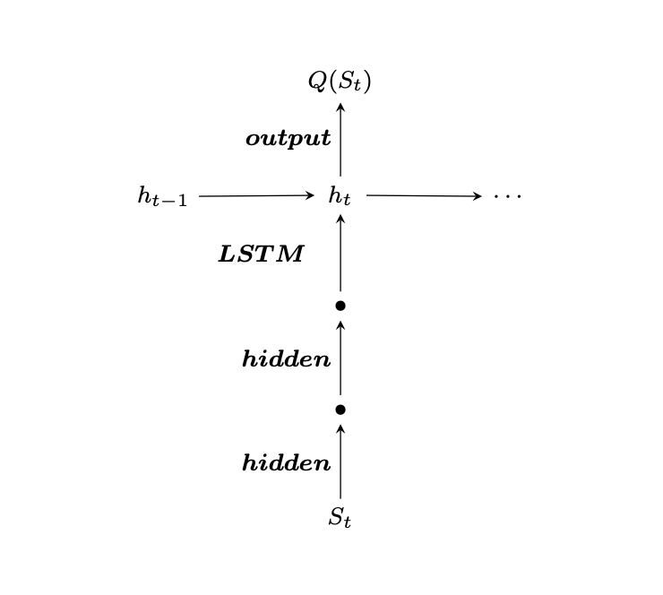
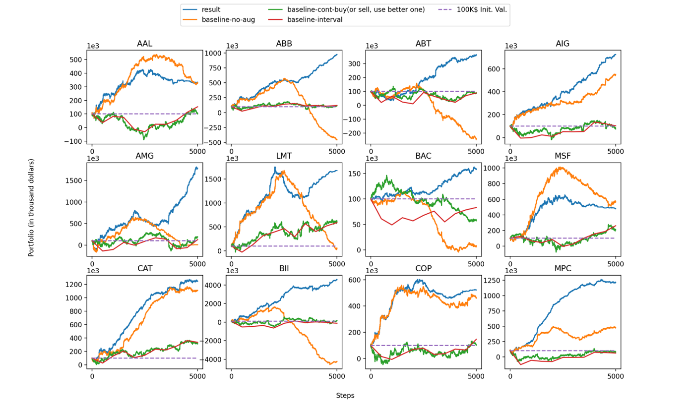
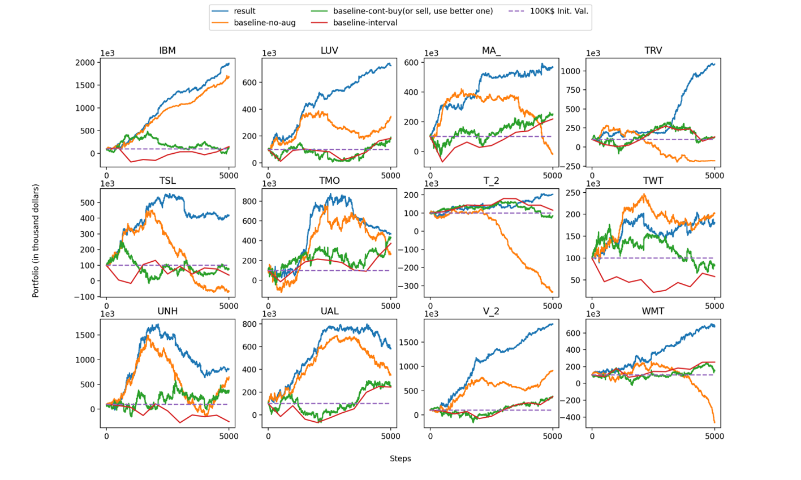
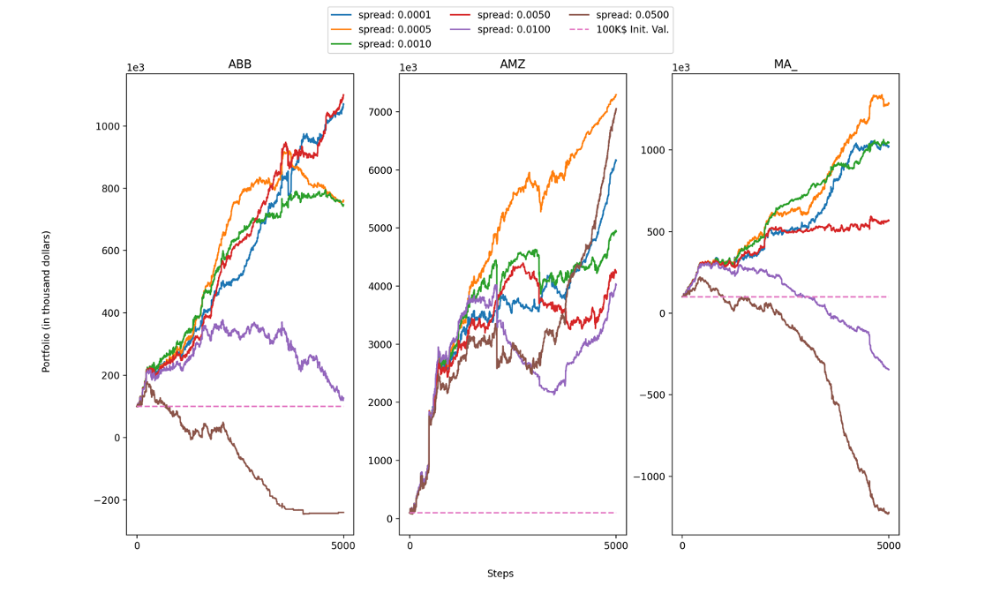
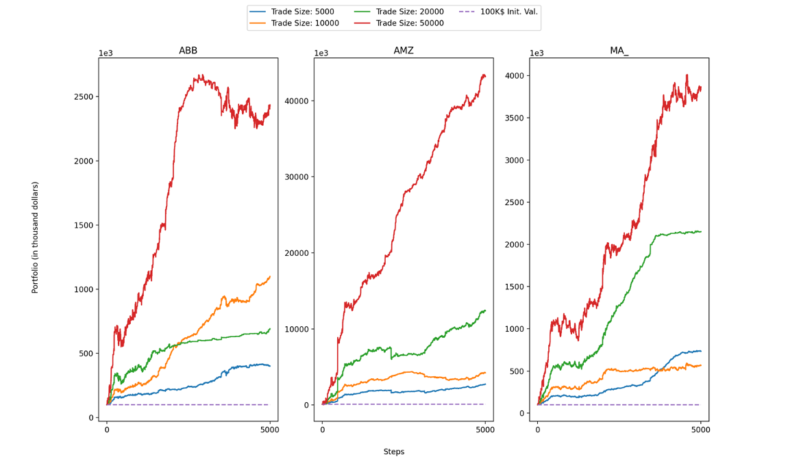
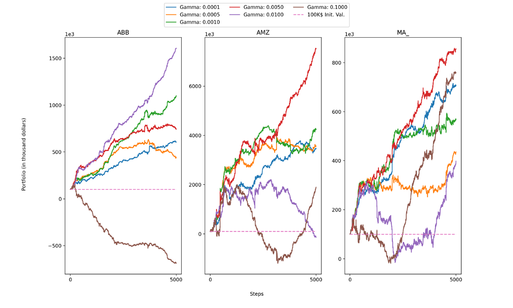

# Implementation of DRQN in Stock Trading
[The link of our presentation video](https://northwestern.hosted.panopto.com/Panopto/Pages/Viewer.aspx?id=a1adde11-332c-4852-ad23-ace900762d81)

# Background

## Deep Recurrent Q Network
The model the paper used is called Deep Recurrent Q-Network (DRQN). It is a kind of model that adds Recurrent Network layers to original DQN. 

The main idea behind Q-learning is that if we had a function Q∗:State×Action→ℝ. that could tell us what our return would be, if we were to take an action in a given state, then we could easily construct a policy that maximizes the reward:


And then, we can design a deep neural network as a universal function approximator. And we can train it to resemble Q∗.

Indeed, DQN is a powerful model for many problem domains. However, they are limited in the sense that they learn a mapping from a limited number of past states. This is a scenario where Recurrent Network can be reasonably applied. Specifically, to implement Deep Recurrent Q-Network, we may add an LSTM layer to remember states from the past.

## Financial Trading
There are some characteristics we need to notice during designing methodology in the field of finance.
1. The agent interacts with the financial market at discrete time steps even though the time steps may be extremely close, say, in the high frequency trading, trading decisions can be made in the matter of milliseconds.
2. There is a set of legal actions an agent can apply to the market from naively submitting market orders with a fixed position size to submitting a fully specified limit order. And the trading size and historical position directly impact the cost of a single trading action.
3. The financial market produces new information available to the agent at each time step enables the agent to make trading decisions. However, the agent doesn’t have no idea about the future trends of the market price.
4. The agent has the potential to alter, although without full control over, the financial market if it is powerful enough. Hence it is not entirely realistic to consider the market to be fully exogenous to the agent.
5. The initial balance is 100,000, but the trading action won't use the balance to buy, hold or sell stocks. The balance here has two functions: 1) pay for the commission; 2) absorb profits or losses. There are three trading actions: bear transaction (-1), no-transaction (0), and bull transaction (1). Bear transaction means the agent believes the stock price will fall in the future, then it borrows stocks from the securities company and sells them with the open price, finally, it buys the same amount of stocks and returns them to the securities company. No-transaction indicates the agent won't take any trading action. Moreover, if the agent takes the bull transaction, it will borrow money from the securities company and buy stocks when the market starts, until the market is going to close, the agent will sell the stocks with the close price and return the money. Both bear and bull transactions are required to pay commissions to the securities company.

In the following implementation, we will take all these features into account and build a reasonable DRL framework to produce optimal trading actions in finance.

# How to process the given data of stock prices
## How to split the data set
The original data used in the paper charges hundreds of dollars, thus we use the data given by Prof. Liu directly. The given stock price data covers from 2015 to 2020 in minute-level, and the given index of each stock includes volume, open price, close price, etc. Considering our problem, we split and group the data with the interval of 30 minutes since 5 years is too long. To achieve this, we first change the time in csv into the form that is easy to be added and subtracted.
```python
def parse_time(text):    
    year = int(text[0:4])
    month = int(text[5:7])
    day = int(text[8:10])
    
    hour = int(text[11:13])
    mins = int(text[14:16])
    sec = 0
    return datetime.datetime(year, month, day, hour, mins, sec)
```
Then we can group the time into the one with intervals of 30 minutes as follows:
```python
# change to time with interval of 30 mins
def map_datetime(dt):
    dt0 = dt
    return dt0.replace(minute=((dt.minute // 30)) * 30, second=0)
```
And in each group, we are interested in the stock price, especially the open and closing price of each time step. Thus we regard the open price of the first member as the open price of the interval, and the close price of the last member is the closing price of this interval.
```python
def get_ohlc(bucket):
    o, c = bucket[0], bucket[-1]
    h = max(bucket, key=lambda a: (a[1] + a[2]) / 2.0)
    l = min(bucket, key=lambda a: (a[1] + a[2]) / 2.0)
    return o, h, l, c
```
In addition, the closing price of the last interval is the opening price of the current interval, therefore we just need to record the pairs of time and closing price.
```python
buckets = OrderedDict()
    for t, o_p, c_p in zip(time_list[index], open_price_list[index], close_price_list[index]):
        printed_time = str(map_datetime(t))
        if printed_time not in buckets:
            buckets[printed_time] = []
        buckets[printed_time].append((t, o_p, c_p))
    # calculate ohlc data
    ohlc = OrderedDict()
    for t, bucket in buckets.items():
        ohlc[t] = get_ohlc(bucket)

    closing = list(map(lambda t_v: (t_v[0], t_v[1][3][2]), ohlc.items()))
```
And we also conduct similar operations for the volume of each stock.

## How to prepare for the state feature
The original paper is the solution to the problem of trading among currencies, i.e., each currency can exchange with any other currency, thus it can aggregate all currencies tick by tick to construct the feature of states. However, in our problem, stocks of different companies cannot be traded, thus we prepare the state feature for each company independently. The state feature consists of three parts: time feature, log returns and previous position. As written in the paper, we conduct the log operation for closing prices of 8 most recent intervals and regard the results as 8 features of a state whose time equals the time of the current interval.
```python
# calculate 8-delayed-log-returns of closing prices
    n = 8
    log_returns = []
    lag = deque()
    last_price = None
    for t, v in closing:
        if last_price is not None:
            lag.append(math.log(v / last_price))
            while len(lag) > n:
                lag.popleft()
                
            if len(lag) == n:
                log_returns.append((t, list(lag)))
        last_price = v
```
As the features of states will be fed to LSTM in the form of series data, we conduct Z-Score normalization on each feature with a period of 96 states.
```python
# z-score normalization, group 96 states into a cluster
    z_score_clusters = OrderedDict()
    for n, t_vs in enumerate(log_returns):
        i = n // 96
        if i not in z_score_clusters:
            z_score_clusters[i] = []
        z_score_clusters[i].append(t_vs[1])

    z_score_transformed = []
    for n, t_vs in enumerate(log_returns):
        i = n // 96
        mean, variance = calc_z_scores_parameters(z_score_clusters[i])
        z_score_transformed.append([t_vs[0], z_transform(t_vs[1], mean, variance)])
```
Moreover, we also add another part of time, which is encoded via a sinusoidal function, into the state features.
```python
def time_features(dt):
    min_f = math.sin(2 * math.pi * dt.minute / 60.)
    hour_f = math.sin(2 * math.pi * dt.hour / 24.)
    day_f = math.sin(2 * math.pi * dt.weekday() / 7.)
    return min_f, hour_f, day_f
```
Finally, it's time to compose the sequential states and enable them to be accessed iteratively. We group the most recent 96 states as the series of the current state.
```python
def iterator(self):
    d = deque()
    for v in zip(self.closing[7:], self.state_space):
        closing = v[0][1]
        time = time_features(parse_time(v[0][0]))
        features = v[1][1]
        features_total = features
        features_total.extend(time)

        d.append(features_total)
        while len(d) > self.T:
            d.popleft()

        if len(d) == self.T:
            yield closing, list(d)
```
Currently, the only missing part is the previous position, which is determined by the recent trading action. In our implementation, we first get a new state sequential data by another iteration then concatenate the current action (the action is encoded by one-hot) with the state feature.
```python
def merge_state_action(self, state, a_variable):
    T = len(state)
    actions_for_state = self.actions[self.data.n:][:T-1] 
    actions_for_state.append(a_variable)

    diff = T - len(actions_for_state)
    # print(diff)
    if diff > 0:
        actions_for_state.extend([a_variable] * diff)

    result = []
    for s, a in zip(state, actions_for_state):
        new_s = deepcopy(s)
        new_s.extend(hot_encoding(a))
        result.append(new_s)

    result = np.asarray(result)
    return result
```
# The basic workflow of DRL trading agent
The basic workflow of the agent can be divided into several steps. At the beginning, the agent needs to get an initial state and then we set the initial action is 0. After the merge of state features (state t), the agent can obtain the action (action t) and the profit induced by this action (portfolio t) by feeding the state data to the target policy network. Besides, at state t, the agent can also obtain rewards and new states of all possible actions (actions t), then all of these results will be stored in a replay memory (**Action Augmentation Process**). Subsequently, after another merge of state t+1 and action t, the state data will be fed into the target network again to obtain action t+1, and this process will continue cycle by cycle until the replay memory is larger than a set threshold (10 * batch_size). In the end, the agent will randomly sample training pairs from the replay memory and optimize the exploration and target policy network. Next, we will introduce these steps in detail.

## How to build the trading environment
First, we need to initialize the beginning state 0 and action 0 as follows (we set action 0 = 0).
```python
def reset(self) -> object:
    self.portfolio = [float(self.initial_value)]
    self.data.reset()
    self.actions.append(0)
    closing, state_initial = self.data.next()
    self.prev_close = closing
    return self.merge_state_action(state_initial, 0)
```
Here, merge_state_action() is merging the aforementioned previous position (argument a_variable) with features of the current state (argument state).
```python
def merge_state_action(self, state, a_variable):
    T = len(state)
    actions_for_state = self.actions[self.data.n:][:T-1]
    actions_for_state.append(a_variable)
    diff = T - len(actions_for_state)
    if diff > 0:
        actions_for_state.extend([a_variable] * diff)

    result = []
    for s, a in zip(state, actions_for_state):
        new_s = deepcopy(s)
        new_s.extend(hot_encoding(a))
        result.append(new_s)

    result = np.asarray(result)
    return result
```
After the initialization of the beginning state and action, we need to obtain the rewards of all possible actions at given state. This process is called as **Action Augmentation** in the paper, which is the main contribution.
```python
def step(self, action, step) -> object:
    actions = [-1, 0, 1]
    v_old = self.portfolio[-1]

    try:
        closing, state_next = self.data.next()
        done = False
    except:
        state_next = None
        done = True

    new_states = []
    for a in actions:
        new_states.append(self.merge_state_action(state_next, a))

    current_closed = closing
    if self.prev_close is not None:
        current_open = self.prev_close
        self.prev_close = current_closed
    else:
        raise Exception("No previous close price saved!")

    v_new = []
    for a in actions:
        commission = self.trade_size * np.abs(a - self.actions[-1]) * self.spread
        v_new.append(v_old + a * self.trade_size * (current_closed - current_open) - commission)

    v_new = np.asarray(v_new)
    rewards = np.log(v_new / v_old)
    if step % 20 == 0:
        print(float(v_new[action+1]))

    self.actions.append(int(action))
    self.portfolio.append(float(v_new[action+1]))

    return actions, rewards, new_states, new_states[action+1], done
```
Here the variable 'commission' is the cost of each trading action which is decided by two arguments -- spread and trade size, and 'v_new' is the updated account balance. The rewards here are the log difference between the balance before and after taking the action. All the implementation formulas are the same as the paper.

## How to build the agent
In the Agent class we define the RL agent that observes the state and takes the action. First we define the initialization method. Here we assign the hyperparameters for our agent, such as Gamma, Epsilon, and Batch Size.

```python
class Agent:
    def __init__(self, state_size=14, T=96, is_eval=True):
        self.state_size = state_size # normalized previous days
        self.action_size = 3
        self.memory = ReplayMemory(10000)
        self.inventory = []
        self.is_eval = is_eval
        self.T = T

        self.gamma = 0.99
        self.epsilon = 1.0
        self.epsilon_min = 0.01
        self.epsilon_decay = 0.995
        self.batch_size = 16
        if os.path.exists('models/target_model'):
            self.policy_net = torch.load('models/policy_model', map_location=device)
            self.target_net = torch.load('models/target_model', map_location=device)
        else:
            self.policy_net = DRQN(state_size, self.action_size).to(device)
            self.target_net = DRQN(state_size, self.action_size).to(device)
            for param_p, param_t in zip(self.policy_net.parameters(), self.target_net.parameters()): 
                weight_init.normal_(param_p)
                param_t = param_p
        self.optimizer = optim.RMSprop(self.policy_net.parameters(), lr=0.00025, momentum=0.9)
```

Then we define our `act` method. This method will select an action accordingly to an epsilon greedy policy. That means that we will mainly use our model for choosing the action, but sometimes we will just sample one action uniformly.

```python
def act(self, state):
    if not self.is_eval and np.random.rand() <= self.epsilon:
      	return random.randrange(self.action_size) - 1

    tensor = torch.FloatTensor(state).to(device)
    tensor = tensor.unsqueeze(0)
    options = self.target_net(tensor)
    return (np.argmax(options[-1].detach().numpy()) - 1)
```

We also define the `store` method. This method will store the state, action, new state, and reward in the memory.

```python
def store(self, state, actions, new_states, rewards):
  	for n in range(len(actions)):
    		self.memory.push(state, actions[n], new_states[n], rewards[n])
```

Finally, we define the `optimize` function that performs a single step of the optimization. It first samples a batch, concatenates all the tensors into a single one, computes the values, and combines them into our loss.

```python
def optimize(self, step):
    if len(self.memory) < self.batch_size * 10:
        return
    transitions = self.memory.sample(self.batch_size)
    batch = Transition(*zip(*transitions))

    # Compute a mask of non-final states and concatenate the batch elements
    # (a final state would've been the one after which simulation ended)
    next_state = torch.FloatTensor(batch.next_state).to(device)
    non_final_mask = torch.tensor(tuple(map(lambda s: s is not None, next_state)))
    non_final_next_states = torch.cat([s for s in next_state if s is not None])
    state_batch = torch.FloatTensor(batch.state).to(device)
    action_batch = torch.LongTensor(torch.add(torch.tensor(batch.action), torch.tensor(1))).to(device)
    reward_batch = torch.FloatTensor(batch.reward).to(device)
    l = self.policy_net(state_batch).size(0)
    state_action_values = self.policy_net(state_batch)[95:l:96].gather(1, action_batch.reshape((self.batch_size, 1)))
    state_action_values = state_action_values.squeeze(-1)
    next_state_values = torch.zeros(self.batch_size, device=device)
    next_state_values[non_final_mask] = self.target_net(next_state)[95:l:96].max(1)[0].detach()
    expected_state_action_values = (next_state_values * self.gamma) + reward_batch
    # print(expected_state_action_values)

    loss = torch.nn.MSELoss()(expected_state_action_values, state_action_values)

    # Optimize the model
    self.optimizer.zero_grad()
    loss.backward()
    for param in self.policy_net.parameters():
        param.grad.data.clamp_(-1, 1)
    self.optimizer.step()

    # Soft Update
    if step % self.T == 0:
       target_update = copy.deepcopy(self.target_net.state_dict())
       for k in target_update.keys():
        target_update[k] = self.target_net.state_dict()[k] * (1 - 0.001) + self.policy_net.state_dict()[k] * 0.001
       self.target_net.load_state_dict(target_update)
```

The last part of the optimize function is the Soft Update process. A soft update means that the agent updates the target network frequently and very little each step, but not at once. The target network will move slightly to the value of Q-network.

## How to implement the Q-network in PyTorch

We chose to use PyTorch as our deep learning framework for the implementation of the model.



As shown in the above graph, to approximate the optimal action-value function, we use a neural network with 4 layers. The first layer is a fully connected layer with 256 output units. We used ELU activation function. The second layer has the same configuration as the first layer. We construct our third layer as a Recurrent Layer with an LSTM architecture. We set the size of features in hidden state again as 256. Finally, we apply another fully connected layer and set the number of output units as 3, representing 3 actions. In effect, the network is trying to predict the *expected return* of taking each action given the current input.

```python
class DRQN(nn.Module):
    def __init__(self, state_size, action_size):
        super(DRQN, self).__init__()
        self.first_two_layers = nn.Sequential(
            nn.Linear(state_size, 256),
            nn.ELU(),
            nn.Linear(256, 256),
            nn.ELU()
        )
        self.lstm = nn.LSTM(256, 256, 1, batch_first=True)
        self.last_linear = nn.Linear(256, 3)

    def forward(self, input):
        x = self.first_two_layers(input)
        lstm_out, hs = self.lstm(x)

        batch_size, seq_len, mid_dim = lstm_out.shape
        linear_in = lstm_out.contiguous().view(seq_len * batch_size, mid_dim)

        return self.last_linear(linear_in)
```

After building the network architecture, we used experience replay memory for training our DRQN Network. It stores the transitions that the agent observes, allowing us to reuse this data later. By sampling from it randomly, the transitions that build up a batch are decorrelated. It has been shown that this greatly stabilizes and improves the DRQN training procedure.

First, we define `Transition`. It is a named tuple representing a single transition in our environment. It essentially maps state-action pairs to their next_state and reward result.

Then we define the `ReplayMemory` class. It is a cyclic buffer of bounded size that holds the transitions observed recently. It also implements a `.sample()` method for selecting a random batch of transitions for training.

```python
import random
from collections import namedtuple

Transition = namedtuple('Transition',
                        ('state', 'action', 'next_state', 'reward'))

class ReplayMemory(object):
    def __init__(self, capacity):
        self.capacity = capacity
        self.memory = []
        self.position = 0

    def push(self, *args):
        """Saves a transition."""
        if len(self.memory) < self.capacity:
            self.memory.append(None)
        self.memory[self.position] = Transition(*args)
        self.position = (self.position + 1) % self.capacity

    def sample(self, batch_size):
        return random.sample(self.memory, batch_size)

    def __len__(self):
        return len(self.memory)
```

## Training starts
When finishing the implementation of agent, we can start the training.
```python
def run(self, episodes):
    state = self.env.reset() # initial_state

    for step in range(episodes):
        action = self.agent.act(state) # select greedy action, exploration is done in step-method
        actions, rewards, new_states, state, done = self.env.step(action, step)

        if done:
            break

        self.agent.store(state, actions, new_states, rewards)
        self.agent.optimize(step)

    self.env.print_stats()
```
The above code follows the basic logic as mentioned previously, i.e., at the beginning, the agent will initialize the state and the action, then it will store training pairs of all possible actions to the replay memory, finally the agent randomly samples training batch from the memory and optimize the policy network.

# Visualize the results

## Baseline methods setting

We compare our DRL-based trading approach with several baseline methods, and they are 1) continuous buy / sell; 2) interval trading; 3) e-greedy DRL (no Action Augmentation). 

The first baseline assumes the agent always takes one action all the time with a fixed step size. For fair comparison, we also set the trading size of each action as 10,000, and the spread is 0.005. As actions of different time points are same, bull transaction or bear transaction, it is not reasonable to charge the cost of transaction at every state, we take the cost with the step size of 5 states (much less transaction cost than the DRL-based method).

To implement the baseline 2 - interval trading, we divide the time period into 10 pieces and sell 10% stocks periodically at every interval. And each time we trade in a trade size of 10,000. Certainly, the agent also needs to pay the commission when taking selling action. 

We set the third baseline as the model without Action Augmentation when training. This can be categorized as a e-greedy method with no modification to its algorithm part. 

In our practical experiments, we find the action augmentation in the late stage of the training is harmful to the performance, thus we modify the algorithm and limit the augmentation to the beginning. 

## Results Discussion





We selected 24 stocks and plot their performance with the baselines. As the graph shows, our model significantly beats Baseline1 (cont. buy/sell) and Baseline2 (interval buy/sell) all the time. If compared with the 100K initial value, we can see that the final return can be as high as 4000K for BII, and 2000K for IBM. 

If compared with Baseline3 (e-greedy, No Augmentation), we can see that our model will beat Baseline3 most of the time, but not all the time, such as in TWT and MSF. But even if in such cases, Baseline3 did not outperform our model by a lot. However, in many cases, such as in ABB and BII, Baseline3 shows a pattern that the Portfolio will continuously decrease when it reaches a high point. And such pattern does not appear for our model with Action Augmentation. This shows that Action Augmentation is useful as it makes the model more stable.

## Ablation Study

We also conduct ablation study to demonstrate the influence of trading size and spread, which directly determine the transaction cost. In addition, we also conduct experiments of changing the gamma in the soft update for target policy network and see the performance of different cases.

### Spread



We randomly select three stocks and conduct the ablation study on them. As for the spread, we carry out a set of experiments with values of 0.0001, 0.0005, 0.0010, 0.0050, 0.0100, 0.0500. Shown in the above figure, we can conclude that 0.0005 hits the best performance, and it's not true that the lower the spread is, the better the performance will be. Moreover, with the increase of the spread, the commission of each transaction becomes much higher, resulting the balance cannot accumulated. And these conclusions are all consistent with the paper.

### Trade Size



Then we fix the spread as 0.0050, and change the trading size to see its influence. From the figure, we can observe that if the spread is suitable, the balance will accumulate much faster with the increase of trading size, which is very intuitive and reasonable.

### Gamma



Except for the ablation study of the spread and the trading size, we also conduct similar study on the gamma of the soft update, which is not included in the original paper. According to the results shown in the figure, different gammas will produce various performance, and for general speaking, the value of 0.0005 can achieve the best performance. The success of soft update and the relatively small value of gamma indicate that on-policy Q learning might perform badly in stock trading. Certainly, the model performance is dependent on a number of factors.

## Roles

For this project, 

Lixu was in charge of processing the data, generating state features, building the DRL agent training environment, training the model, setting up Baseline 1 and 3, and conducting the ablation studies.

Jing was in charge of implementing the DRQN network, building the DRL agent, setting up Baseline 2, and result visualization.